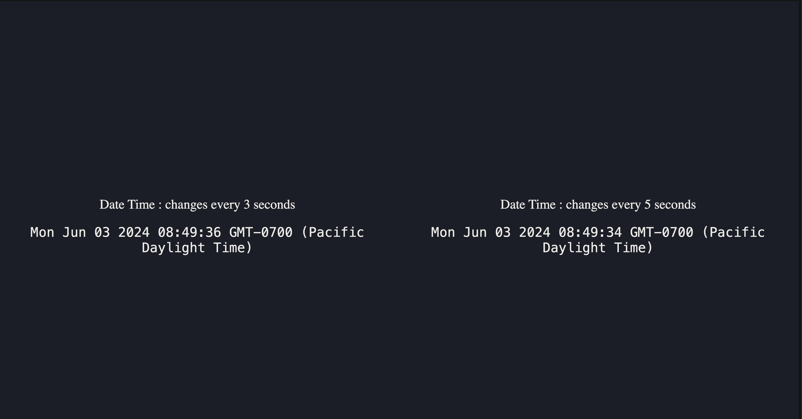

Build a react app that shows two widgets rendered side by side (in equal width)  
Each widget shows the current date time centered in view port.  
The left widget shows the updated view every 3 seconds and the right widgte shows the updated value every 5 seconds.  
date-time string format can be either ISO or any other format.  
the date-time line should render with any fixed-width font, so that there are no momentary jarring etc.  
Mention some room for improvement (setInterval cleanup etc).

